# Architecture

Project Merlin is composed of modular components designed to support AI-native workflows with persistent memory, relevance-matched context, and user-controlled data.

## System Overview

The architecture is modular and layered. Here's a simplified block diagram of major components:

## Detailed Component Flow

The following diagram expands the data flow, with notes on complexity and implementation status:

```mermaid
graph TD
  subgraph Client
    A1["User Interface
    (Jupyter, TUI, Web)"]:::legendEasy
    A2[Session Log]:::legendEasy
  end

  subgraph Context Engine
    B1[Prompt Assembler]:::legendHard
    B2["Memory Hooks
    (gestalt references)"]:::legendHard
  end

  subgraph Annotator
    C1[Session Annotator]:::legendAI
    C2[Prompt Context]:::legendAI
    C3[Gestalt Summary]:::legendAI
    C4[Memory Tags]:::legendAI
  end

  subgraph Vault
    D1[Gestalts.md]:::legendEasy
    D2[memory.md]:::legendEasy
    D3[Versioned Store]:::legendEasy
  end

  subgraph Sidecar
    E1[Gestalt Trigger]:::legendExpensive
    E2[Vault Writer]:::legendExpensive
    E3[Hook Updater]:::legendExpensive
  end

  F1["LLM
  (GPT-4o, Claude, etc.)"]:::legendAI

  A1 --> A2
  A2 --> B1
  B1 --> F1
  B1 --> B2
  B2 --> D2

  A2 --> C1
  C1 --> C2
  C1 --> C3
  C1 --> C4

  C2 --> B1
  C3 --> E1
  C4 --> D2

  E1 --> E2
  E2 --> D1
  E2 --> D2
  E3 --> D2

  F1 --> A1
  F1 --> C1

  %% Legend
  L1[✅ Known + Easy]:::legendEasy
  L2[⚙️ Known + Expensive]:::legendExpensive
  L3[🤯 Hard / Complex]:::legendHard
  L4[🔮 AI-Heavy / Unknown]:::legendAI

  %% Position legend inline or at bottom
  L1 --> L2
  L2 --> L3
  L3 --> L4

  %% Styles
  classDef legendEasy fill:#ddffdd,stroke:#000,stroke-width:1px
  classDef legendExpensive fill:#ddeeff,stroke:#000,stroke-width:1px
  classDef legendHard fill:#fff3c4,stroke:#000,stroke-width:1px
  classDef legendAI fill:#fdd,stroke:#000,stroke-width:1px
```

Legend:
✅ Known + Easy | ⚙️ Known + Expensive | 🤯 Hard / Complex | 🔮 AI-Heavy / Unknown

## Component Descriptions

### Annotator

The Annotator is responsible for transforming raw user–LLM interactions into structured memory elements. It operates on each session in real-time or post hoc, analyzing the conversation to generate:

* **Prompt Context**: A distilled, focused version of the conversation relevant to the user’s current objective.
* **Gestalt Summary**: A session-wide narrative or theme that captures emergent meaning, turning loosely connected exchanges into memorable structure.
* **Memory Tags**: Key phrases, topics, or identifiers that can be used to link future prompts to this conversation (used by memory hooks in the Context Engine).

#### Behavior

1. Listens to all exchanges in the session log.
2. On trigger (manual or automatic), generates:

   * A context extract suitable for replay or injection.
   * A high-level summary written in narrative form (the "gestalt").
   * A tag list to enrich future context-matching.

#### Dependencies

* LLM: Requires an LLM capable of summarization, key phrase extraction, and stylistic framing.
* Token budget awareness: Summaries and context must fit within configured size constraints.

#### Implementation Notes

* Designed to run as a sidecar process, but may be colocated with the Context Engine for latency-sensitive setups.
* All generated content is stored in the Vault (`gestalts.md`, `memory.md`) and indexed via hooks.
* Can be rerun or extended without reprocessing entire sessions, if segment boundaries are tracked.

### Context Engine

The Context Engine is responsible for assembling the prompt sent to the LLM. It ensures relevance, continuity, and memory-aware augmentation of every user query.

#### Behavior

1. Receives the user's current message and session log.
2. Uses hooks to fetch relevant past summaries, tags, or memory entries.
3. Builds a composite prompt consisting of:

   * Current user message
   * Context fragments from the Annotator
   * Relevant gestalts and memory tagged by hooks
4. Dispatches the prompt to the selected LLM.

#### Components

* **Prompt Assembler**: The core logic that compiles a complete prompt from raw and structured memory sources.
* **Memory Hooks**: Lightweight references or match rules for linking new inputs to past context, including tag matches and conversational patterns.

#### Dependencies

* Vault interface: to retrieve summaries, tags, and memory content.
* Annotator outputs: to provide structured, reusable summaries.
* Hook matcher: to index and query matching tags and themes.

#### Implementation Notes

* Token budgeting is critical; context injection must respect model constraints.
* Modular prompt formats are supported to tailor for different LLM providers.
* Expected to call the Annotator only when context is insufficient or incomplete.

### Sidecar

The Sidecar monitors conversation state and triggers memory capture and maintenance behaviors as the session evolves. It ensures key session elements are committed to persistent memory (Vault) and available for reuse.

#### Behavior

1. Observes session events in real time.
2. Activates the Annotator when specific triggers occur (e.g. major thematic shift, long exchange, emotional intensity, or manual save).
3. Collects results from the Annotator and writes to Vault:

   * Gestalt summary
   * Tags
   * Extracted context
4. Updates memory hooks with new tag-to-context mappings.

#### Components

* **Gestalt Trigger**: Determines when a session deserves a new memory entry.
* **Vault Writer**: Appends structured content to memory documents with versioning.
* **Hook Updater**: Refreshes in-memory or persisted hook data structures.

#### Dependencies

* Annotator: to produce summaries and tags.
* Vault: to persist memory entries.
* Hook system: to maintain relevance-matching for the Context Engine.

#### Implementation Notes

* Sidecar may run continuously or be invoked at defined checkpoints.
* Can be configured to operate in passive mode (suggesting saves) or active mode (automatic writes).
* Will eventually support plugin-based customization for domain-specific memory handling.

### Vault

The Vault is a versioned document store that provides persistent, user-owned memory. It is the foundation of continuity, responsible for storing all structured outputs from the Annotator and all hook references used by the Context Engine.

#### Behavior

1. Accepts structured input from the Sidecar:

   * Gestalt summaries
   * Memory tags
   * Extracted context
2. Stores content in versioned Markdown or JSON files (`gestalts.md`, `memory.md`).
3. Serves content via a lightweight API for:

   * Tag lookups
   * Full text retrieval
   * Time-based filtering

#### Components

* **Gestalts.md**: A human-readable file containing gestalt summaries, tagged and timestamped.
* **memory.md**: A structured log of tagged context snippets and session fragments.
* **Versioned Store**: The underlying persistence mechanism (can be Git, SQLite-backed Markdown, or external DB like Weaviate or Firestore).

#### Implementation Notes

* Designed for full local ownership: no cloud dependencies unless explicitly chosen.
* Minimal query interface: simple tag matching and content slicing suffice for early prototypes.
* Can be swapped out or extended with richer vector search or schema validation layers later.

### Client

The Client is the interface through which users interact with the system. In the MVP, this will be JupyterAI, extended with a custom provider that routes requests through the Context Engine and uses the Vault for memory retrieval.

#### Notes

* Off-the-shelf: uses JupyterAI as a front-end.
* Requires no modification to support the flow beyond custom provider setup.
* May later be expanded with a Web UI or TUI wrapper.

### LLM Provider

The LLM module supports inference from one or more language models. A BearBorg provider is already in place and will be extended to support:

* Prompt injection from the Context Engine
* Metadata tagging and streaming hooks
* Multi-model dispatch (optional in later versions)
